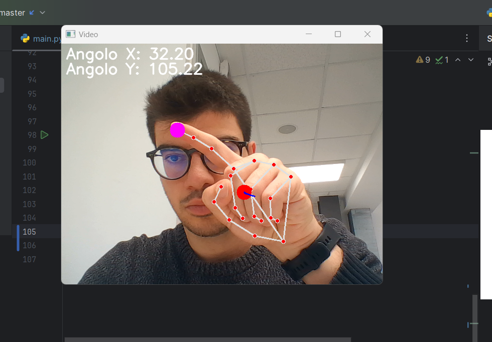
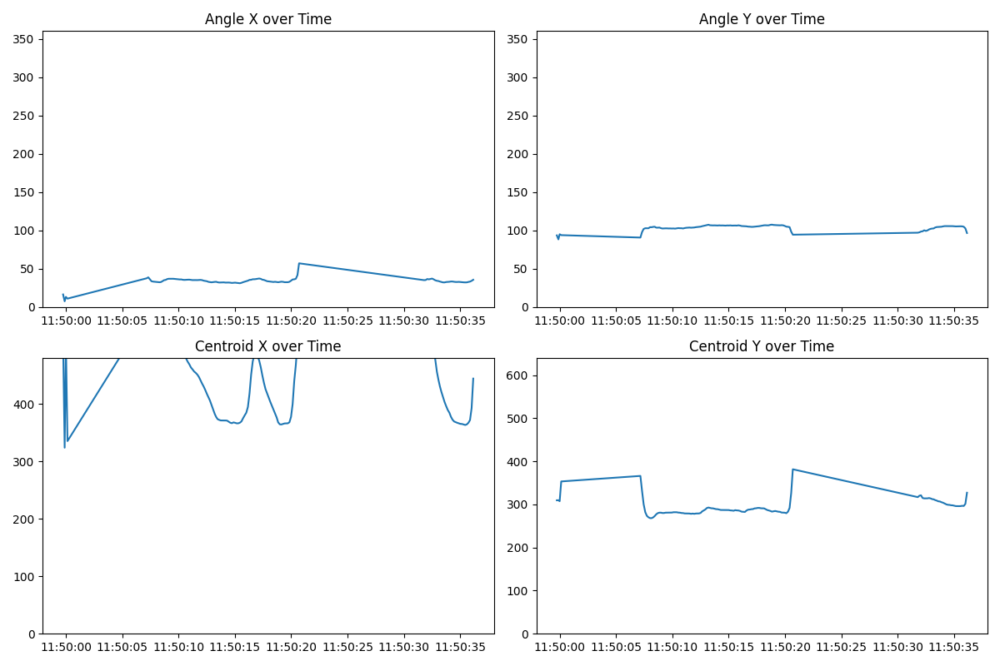
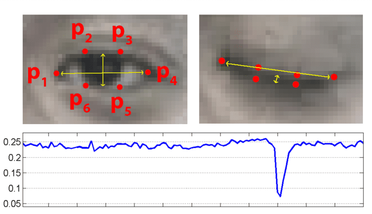
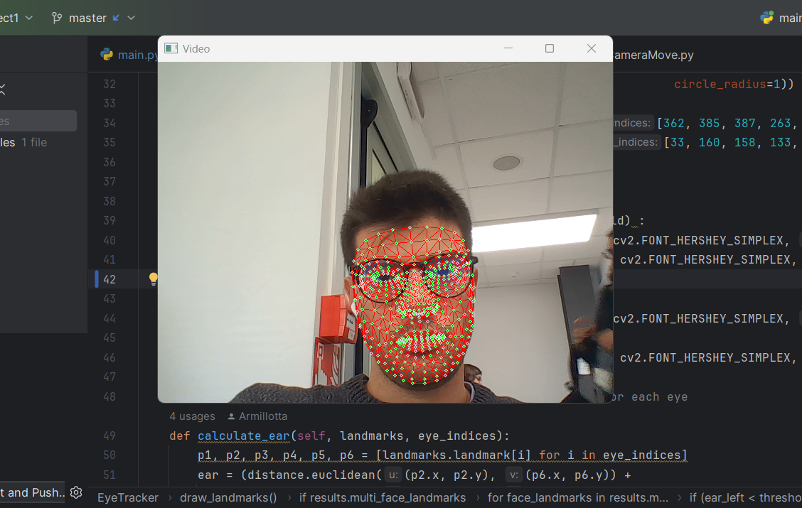
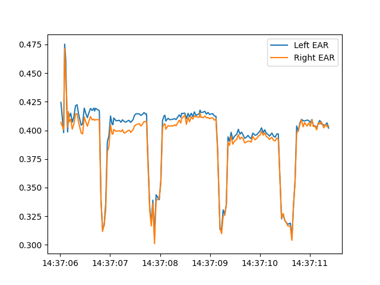
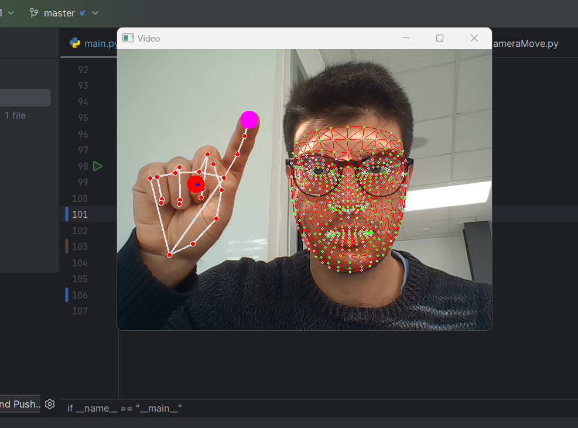
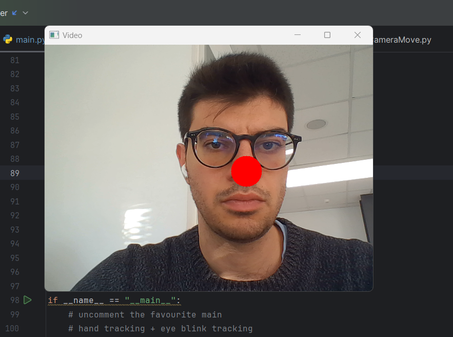
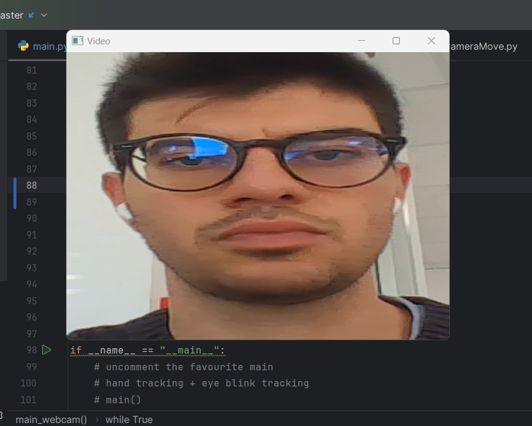

# First Part : Mouse control with eyes and fingers
All these implementations have been carried out utilizing the Mediapipe library. The ultimate objective is to control the mouse by using the index finger to manipulate the cursor and perform clicks based on eye blinks.

## Finger Detection
The finger detection has been completed and is sufficiently accurate in landmark detection. A red dot has been added to the center of the hand, and a pink dot on the index finger controls the cursor. Additionally, data such as hand rotation on the X-axis and self-rotation are computed. Hand openness/closure detection has also been implemented to incorporate additional functionalities.

All the data is saved in a dataframe, which will be used for plotting the temporal evolution of the gathered information. An example of hand detection and the generated plots can be seen in the figure.

## Eye Blink Detection
For the eye blink detection, the Mediapipe library was employed. However, as there is no direct module for iris detection, a technique called Eye Aspect Ratio (EAR) was utilized. This method involves considering points around the eye and calculating the distance to determine whether the eyes are open or closed. The concept is illustrated in the figure with accompanying images.

It does not work perfectly when wearing glasses due to reflections. Additionally, for increased robustness, the click action is triggered only when both eyes perform the blink simultaneously.

## Merging
These two hand and blink detection techniques have been integrated, and the computational load has been reduced by eliminating unnecessary features, such as calculating the hand rotation angle. In a demonstrative video, it is evident that the integration works effectively and is usable, performing at a high frames-per-second (fps) rate.

# Second Part : dinamic Webcam

## Face Detecting
  
Initially, face detection was experimented with using facial landmarks. In this experimental phase, a red nose was added, which varied in size based on the proximity to the camera. No depth estimation was performed with a neural network, but rather the proportion of the nose was calculated and adjusted based on the diameter of the detected face.

The face detection is highly robust, performing well even in the presence of glasses or reflections and in cases of partial or extreme facial angles. This robustness has facilitated the progression of other projects using this library. This experiment served the purpose of understanding the limits of detection and evaluating performance.

## Dynamic webcam implementation
In this phase, the goal was to create an intelligent webcam that tracked the person's face based on their movements. Since servo motors were not available, the decision was made to create a cropped region that followed the face and resized the cropped area to fit the window. 

This approach gives the illusion that the camera is dynamically following the person, similar to the intelligent webcams seen in recent years.

